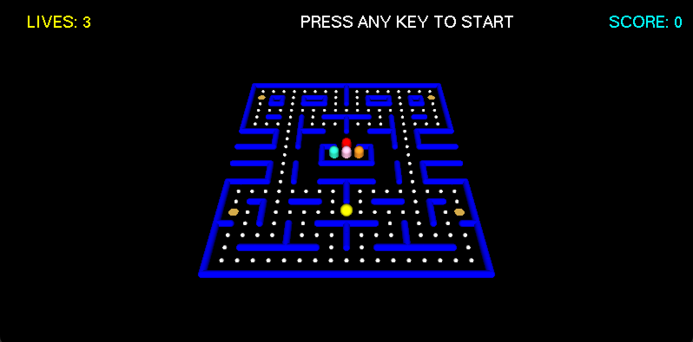

# 🟡 3D Pac-Man Maze (OpenGL + GLUT)

A 3D version of the classic Pac-Man game built in C++ using OpenGL and GLUT.  
Navigate the maze, collect pellets, and avoid ghosts — or turn the tables with power-ups!  
This project demonstrates 3D graphics rendering, camera control, and multithreaded game logic in C++.

---

## Gameplay Overview

Objective: Collect all pellets in the maze while avoiding ghosts.  
Power-Ups: Eat power-ups to make ghosts vulnerable for a short time.  
Lives: You start with 3 lives — lose them all and the game ends.  
Camera: Rotate the maze with arrow keys for better viewing angles.  
Threads: Each ghost runs on its own thread for real-time movement.

---

## Controls

W — Move Up  
A — Move Left  
S — Move Down  
D — Move Right  
← / → — Rotate Map View  
R — Reset Camera  
Q / ESC — Quit Game  
Any Key — Start Game

---

## 💻 Dependencies

### macOS

1. Install Xcode Command Line Tools  
   xcode-select --install

3. Install GLUT (macOS includes Apple GLUT and OpenGL frameworks by default)  
   Optionally install FreeGLUT for consistency:  
   brew install freeglut

### Windows (MinGW)

1. Install MinGW (includes g++ and gdb)
2. Install FreeGLUT development libraries  
   - Ensure headers (GL/freeglut.h) are in your include path  
   - Place freeglut.dll in the same directory as your .exe or add it to your PATH

---

## Build and Run Instructions

### macOS (Apple GLUT using clang)

1. Build the game  
   clang++ -std=c++17 -O2 -Wall -Wno-deprecated main.cpp -framework GLUT -framework OpenGL -lpthread -o pacman

2. Run the game  
   ./pacman

### Windows (FreeGLUT using MinGW)

1. Build the game  
   g++ main.cpp -std=c++17 -O2 -Wall -Wno-deprecated -lfreeglut -lopengl32 -lglu32 -lpthread -o pacman.exe

2. Run the game  
   pacman.exe

---

## Gameplay

---

## Implementation Notes

Language: C++17  
Rendering: OpenGL + GLUT (Apple GLUT on macOS, FreeGLUT on Windows)  
Concurrency: Uses std::thread for ghost logic updates  
Graphics: 3D entities drawn with spheres, cylinders, and quads  
Maze Layout: Defined by a 22×19 grid array (1 = wall, 0 = pellet, 3 = power-up, 2 = empty)
